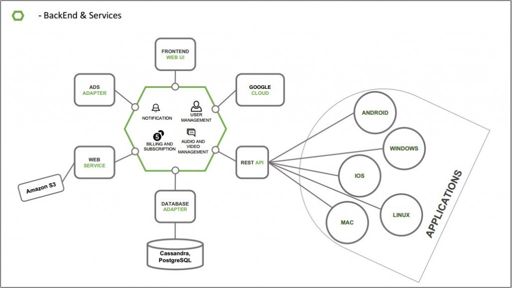
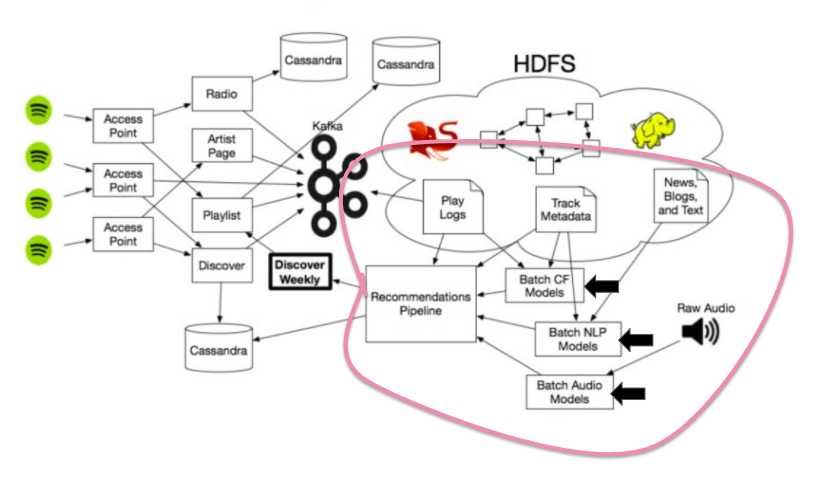
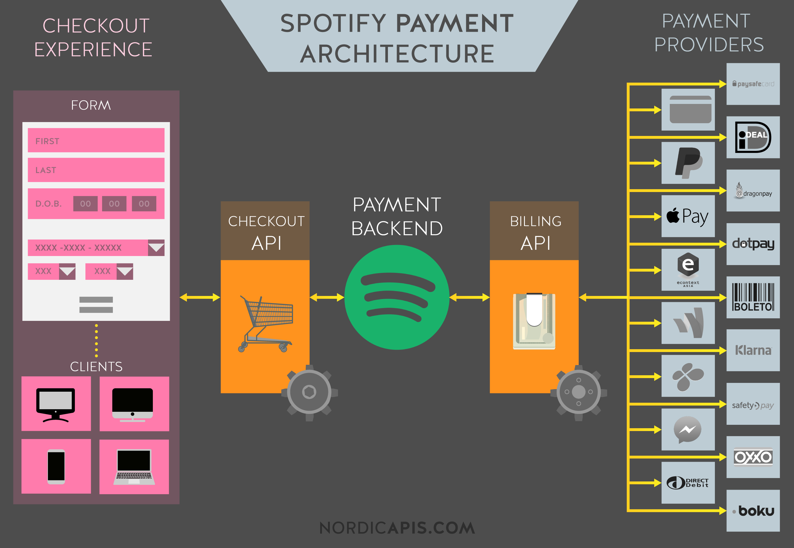

# Taller Mineria de Datos II

_Caso de estudio_

## **Spotify**

El sistema de información principal para el consumo de clientes es una aplicacion que gestione musica por streaming o por demanda, con ciertas caracteristicas que lo hacen muy atractivo al publico como sus playlists de descubrimiento semanal, escuchar musica en modo offline entre otras, toda esta seleccion con configuraciones personalizadas para cada cliente.

### ___Entre los SI que abarca___ _Spotify_ __tenemos__:

- _Operacionales_:
    - Transaccion de tarjeta de crédito por parte de los clientes para obtener un servicio premium.
- _Gerencial_ | _Toma de desiciones_:
    - Machine Learning(Talvez TensorFlow(Google)) para toma de desiciones, una de las utilidades es mostrar el descubrimiento semanal, segun las preferencias de los clientes.
    - CRM
- _Procesos_ | _Planeación de Recursos_:
    - ERP

### Infraestructura TI
_Hardware_ | _Software_ 
 ---- | ---
Server |  Programas
Dispositivos/Perifericos | DataBase
Redes | App 

### Arquitectura TI
_Backend Y server_

_Machine Learning Flow_

_Arquitectura de pagos_

### Seguridad de la informacion, seguridad informatica.

Se parchan varios issues a traves de la actualizacion de sus apps moviles y web, persiguiendo tanto la integridad como interrupiendo un posible ataque.
