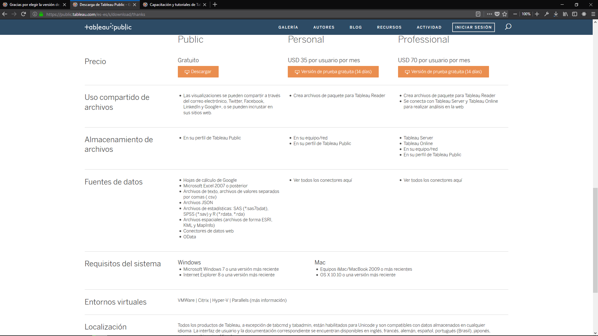
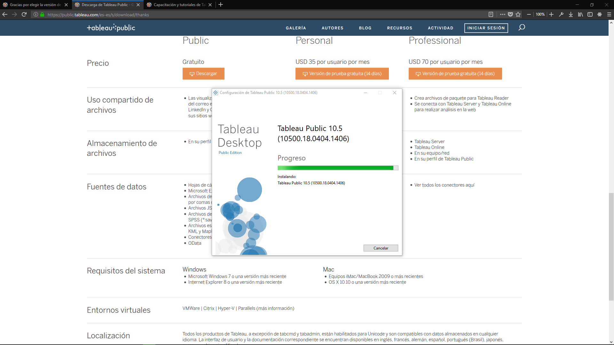
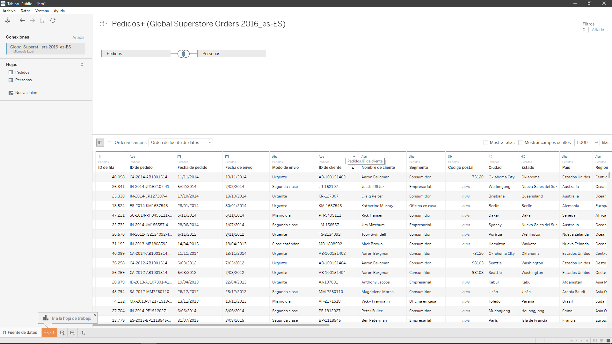
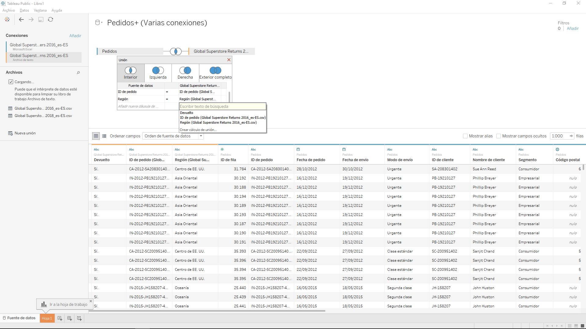
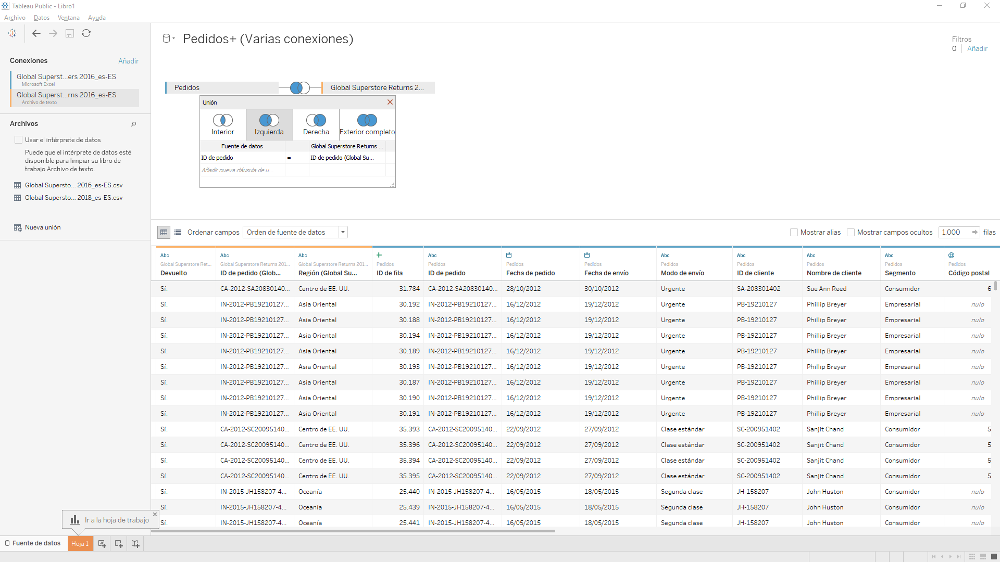
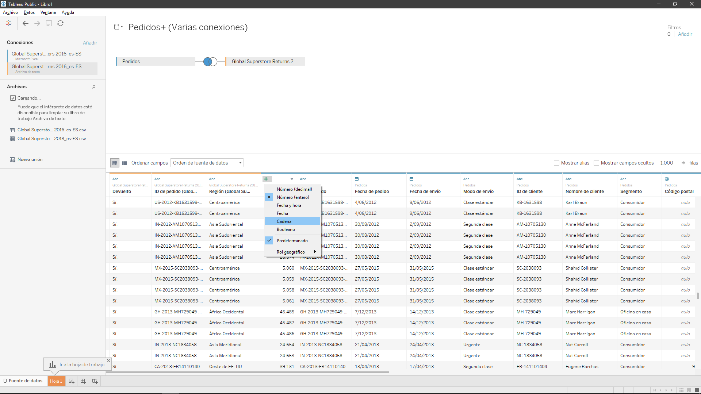
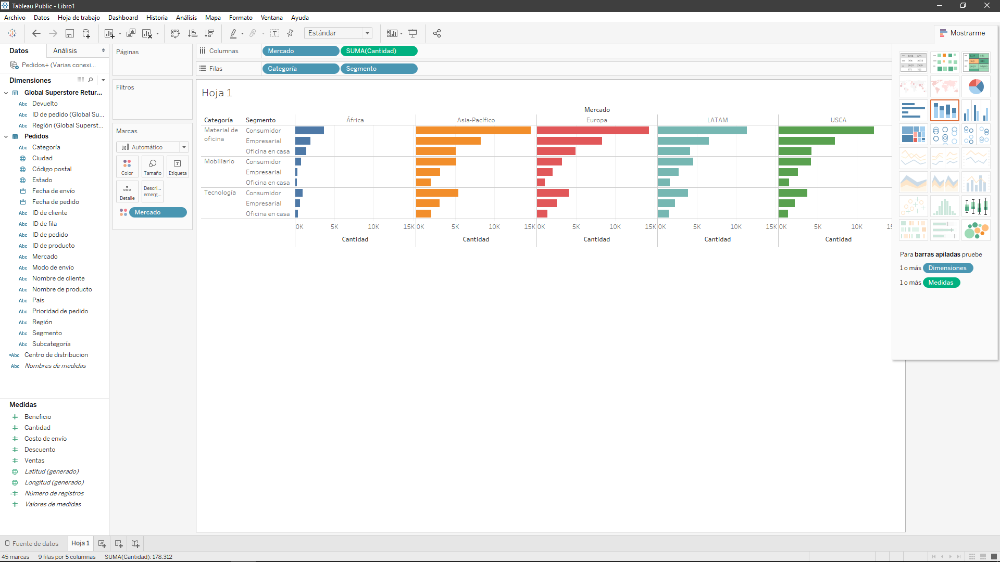
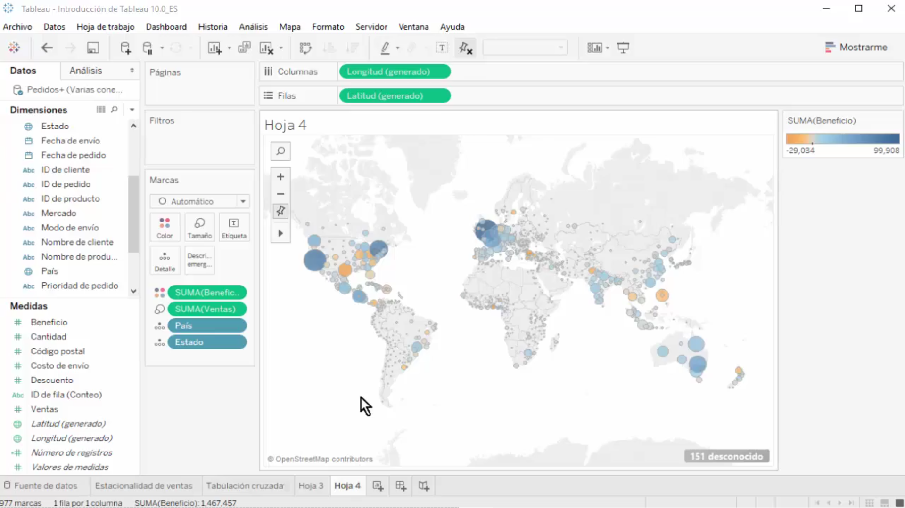

# Tableau

## Tipos y requerimientos de Tableau

Existen tres versiones de Tableau de la cual utilizaremos la version public.

## Instalacion

Luego de descargar la version, procedemos a instalarla, es una instalacion bastante sencilla.

## Abrir una Fuente De Datos
Luego de haber termiando con el programa y haber abierto el software procedemos a escojer nuestra fuente de datos que en este caso es local(Un excel), podemos ver que se pueden generar relaciones entre tablas del mismo archivo.

## Relaciones

Podemos hacer relaciones entre varias fuentes de datos en nuestro caso nuestro excel y un CSV.

**Relacion interior**

**Relacion Izquierda(Recojesmos todos los datos de la tabla Pedidos)**

## Metadata
Podemos ver que podemos alterar campos de las tablas generadas de manera simple.

A partir de un buen cruce y estructuracion de nuestra data podemos comenzar a generar informes a partir de hojas.

## Vizualizando nuestros datos

Entre las multiples utilidades que posee Tableau podemos ver que es tan sencillo mezclar datos de tipo discreto con datos metricos para generar un analisis, con color y demas.

_Mercado de productos por sectores_

Tambien podemos generar un mapa donde podamos ubicar nuestro mercado y el mercado en esta zona.

_Paises que obtienen mas beneficio_

_Tableau_ es una herramienta bastante poderosa que permite hacer todo un proceso de ETL, con diversas y grandiosas funciones, realmente facil de manejar, tambien podemos crear dashboards y reportes web interactivos con dicha aplicacion.

Los datasets se encuentran en este mismo repositorio

### Webgrafia
1. https://www.tableau.com/es-es
1. https://www.tableau.com/es-es/learn/training#getting-started
